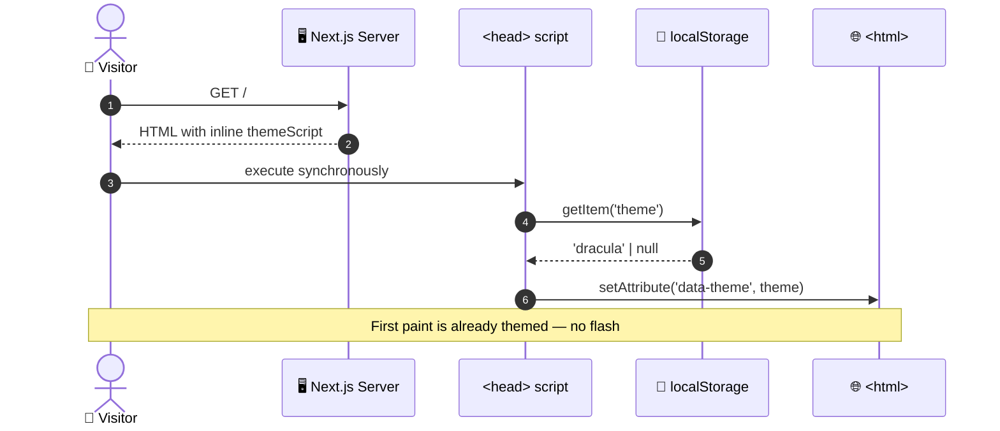
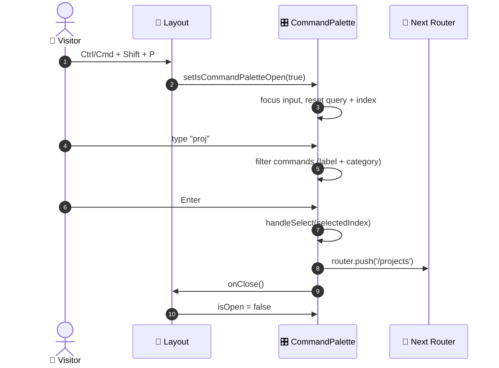
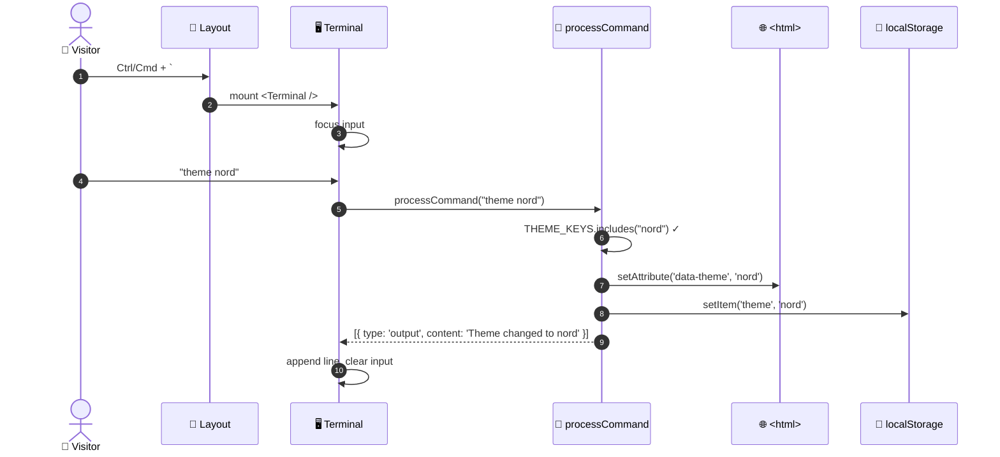
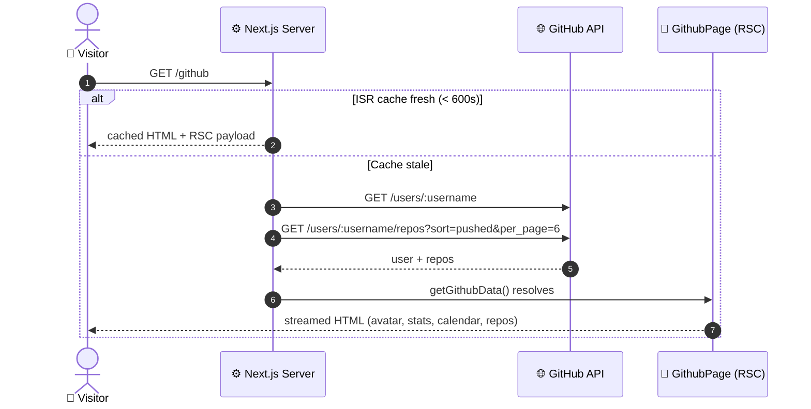
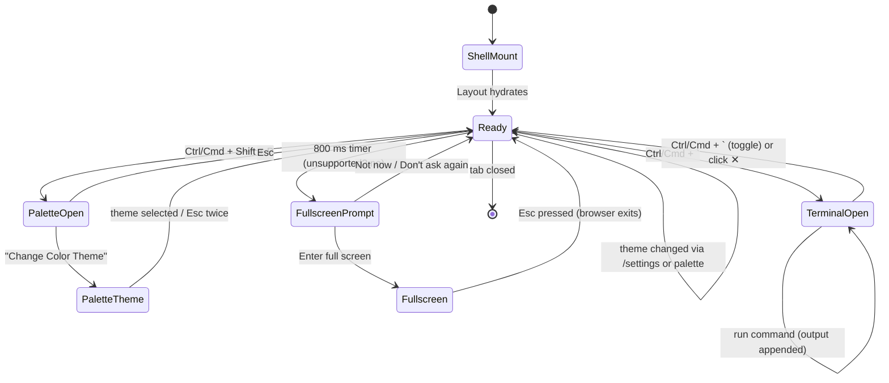
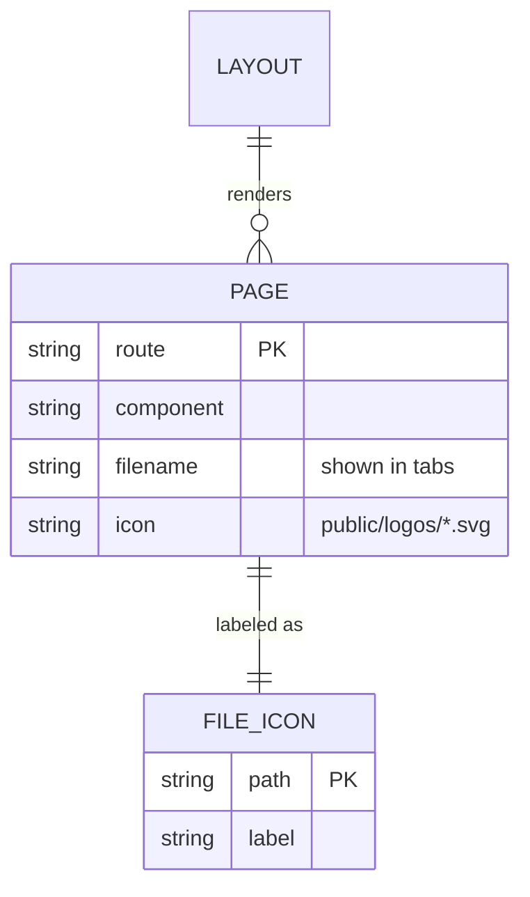
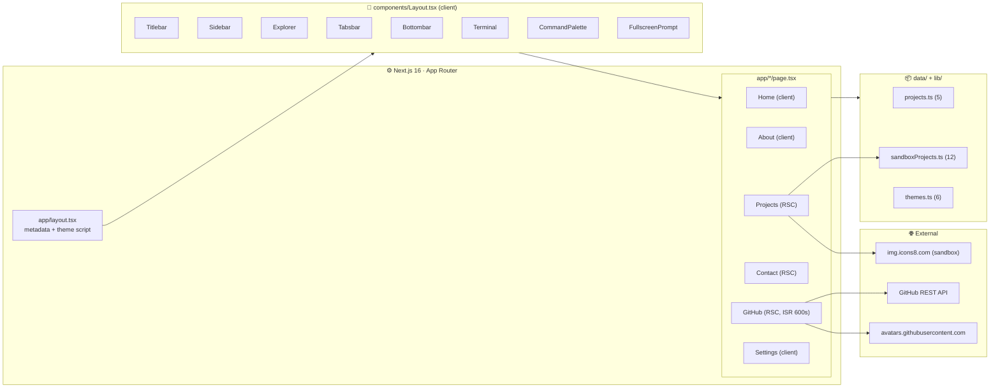
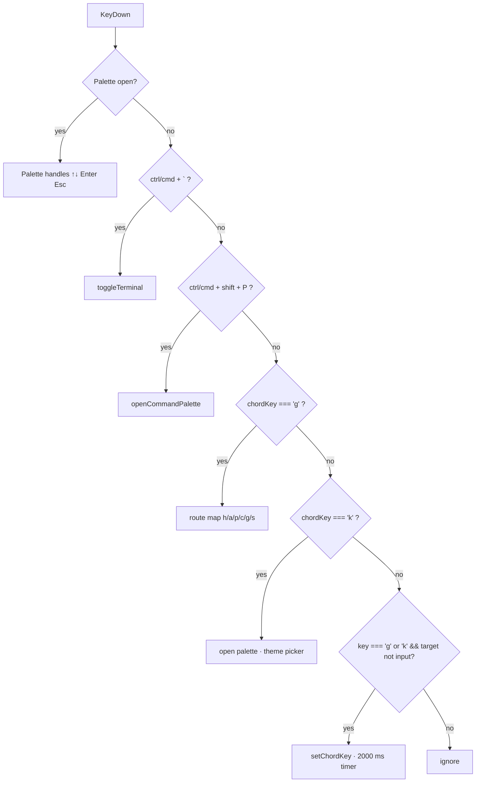

<div align="center">

# 💻 vscode-portfolio

### A developer portfolio disguised as a VS Code window

*An end-to-end specification of how a Next.js App Router site replicates the Visual Studio Code shell — titlebar, sidebar, explorer, tabs, status bar, terminal, and command palette — while serving six routed "files" as portfolio pages, six swappable editor themes, and a GitHub activity feed.*

<br />


</div>

> **Entrypoint:** `/` · **Primary Actor:** Recruiter / Peer Engineer / Curious Visitor · **Trigger:** Any visitor lands on the domain
> **Related Systems:** GitHub REST API · Theme Engine · Command Palette · Interactive Terminal

---

## 📖 Contents

1. [Executive Summary](#1--executive-summary)
2. [Actors & Roles](#2--actors--roles)
3. [Preconditions](#3--preconditions)
4. [Main Success Scenario](#4--main-success-scenario)
5. [Postconditions](#5--postconditions)
6. [Exception & Alternative Flows](#6--exception--alternative-flows)
7. [Sequence Diagrams](#7--sequence-diagrams)
8. [State Machine](#8--state-machine)
9. [Business Rules](#9--business-rules)
10. [Data Contract](#10--data-contract)
11. [UI Reference](#11--ui-reference)
12. [Security & Configuration](#12--security--configuration)
13. [Observability & Feedback Surface](#13--observability--feedback-surface)
14. [Test Scenarios](#14--test-scenarios)
15. [Success Metrics](#15--success-metrics)
16. [User Guide](#16--user-guide)
17. [Technical Design](#17--technical-design)
18. [Roadmap & Known Risks](#18--roadmap--known-risks)

---

## 1 · Executive Summary

> **vscode-portfolio** is a single-page portfolio that wears the VS Code shell as its interface. Every route is framed as a "file," every navigation gesture mirrors an editor shortcut, and every visitor becomes a developer for the duration of their visit.

A visitor lands on a hero home page, then navigates a **persistent editor chrome** — titlebar menus, an activity-bar sidebar, a collapsible explorer tree, a tabs bar, and a status bar — to reach each portfolio surface: **Home**, **About**, **Projects**, **Contact**, **GitHub**, and **Settings**.

- **Navigation is keyboard-first.** The command palette opens on `Ctrl/Cmd + Shift + P`. Chord shortcuts (`G` → `A`) hop between pages. `Ctrl/Cmd + \`` toggles the terminal.
- **The terminal is real.** Commands like `help`, `about`, `skills`, `projects`, `theme <name>`, and `whoami` return typed output.
- **Theme is a CSS-variable swap** on `<html data-theme>`, persisted to `localStorage`, applied before first paint via an inline script.
- **GitHub activity is live.** The `/github` route is a Server Component that fetches the profile, recent repos, and renders a contribution calendar — revalidated every 10 minutes.
- **Fullscreen is a first-class affordance.** A non-intrusive prompt offers to hide browser chrome, then remembers the choice.

The experience targets **a sub-5-second "I get it" moment** — the shell is instantly recognizable, the shortcuts teach themselves through an on-page tips panel, and everything works with or without a mouse.

### 🔑 Key Characteristics

| ⌨️ Keyboard-first | 🎨 Six themes | 🧩 Shell chrome | 🌐 Server-rendered GitHub |
|:---:|:---:|:---:|:---:|
| Palette, chords, terminal all bound | GitHub Dark · Dracula · Ayu × 2 · Nord · Night Owl | Titlebar · Explorer · Tabs · Status bar | Server Component + 10-minute ISR |

---

## 2 · Actors & Roles

| Actor | Type | Responsibility |
|---|---|---|
| 👤 **Visitor** | Primary | Browsing the portfolio; uses mouse, keyboard, or both. |
| 🧑‍💼 **Recruiter / Peer** | Primary | Skimming projects, contact channels, and GitHub proof. |
| ⚙️ **Shell (Layout)** | Supporting | Renders chrome, owns global keyboard chords, coordinates terminal + palette state. |
| 🎨 **Theme Engine** | Supporting | Sets `data-theme`, persists to `localStorage`, applies pre-paint. |
| 🖥️ **Terminal** | Supporting | Interprets commands, mutates theme, prints output. |
| 🌐 **GitHub REST API** | External | Serves user profile + repos consumed at build/ISR time. |
| 🖼️ **Remote Image Hosts** | External | `res.cloudinary.com`, `avatars.githubusercontent.com`, `imgur.com`, `media2.dev.to`. |

---

## 3 · Preconditions

| ✓ | Invariant | Verification |
|:---:|---|---|
| ✅ | **Node 20.9+** (required by Next.js 16) | `package.json` engines / `@next/env` peer. |
| ✅ | **`NEXT_PUBLIC_GITHUB_USERNAME` set** | Consumed by `/github` page for both API calls. |
| ✅ | **Remote images whitelisted** | `next.config.ts` → `images.remotePatterns` lists all four hosts. |
| ✅ | **`localStorage` accessible** | Theme script runs in `<head>`; failures are silently swallowed. |
| ✅ | **JS enabled** | Client Components depend on hydration for palette, terminal, and theme switch. |
| ✅ | **`react-github-calendar` peer satisfied** | `react` `^18 \|\| ^19` — satisfied by `react@19`. |

---

## 4 · Main Success Scenario

| # | Actor | Action |
|:---:|---|---|
| **1** | Visitor | Requests `/`. `RootLayout` renders, injecting the pre-paint theme script from `localStorage`. |
| **2** | System | Renders the shell: `Titlebar`, `Sidebar`, `Explorer`, `Tabsbar`, `main#main-editor`, `Bottombar`. |
| **3** | Visitor | Reads the hero on Home, then presses `Ctrl/Cmd + Shift + P`. |
| **4** | System | `CommandPalette` opens focused on its search input. |
| **5** | Visitor | Types `projects` → presses `Enter`. |
| **6** | System | Router pushes `/projects`; palette closes. |
| **7** | Visitor | Lands on the Projects timeline (5 featured) and the Sandbox grid (12 items). |
| **8** | Visitor | *(Optional)* Opens the terminal with `Ctrl/Cmd + \``. |
| **9** | System | Terminal mounts, autofocuses the input, and welcomes the visitor. |
| **10** | Visitor | Types `theme dracula`. |
| **11** | System | Sets `data-theme="dracula"` on `<html>`, persists to `localStorage`, prints `Theme changed to dracula`. |
| **12** | Visitor | Opens `/github` — a Server Component streams the profile, stats, calendar, and 6 most-recently-pushed repos. |
| **13** | Visitor | *(Optional)* Uses the Fullscreen Prompt to enter full screen; the choice is remembered. |
| **14** | Visitor | *(Optional)* Clicks `contact.css` in the explorer to reach `/contact`. |
| **15** | Visitor | Leaves or copies the email / follows GitHub / Telegram. |

> **🎬 Outcome:** The visitor has browsed the portfolio through a shell they already understand, changed the theme, and found a channel to make contact.

---

## 5 · Postconditions

| | State Change | Detail |
|:---:|---|---|
| 🎨 | **Theme persisted** | `localStorage["theme"]` holds one of `THEME_KEYS`; `<html data-theme>` matches. |
| 📜 | **Route committed** | App Router history reflects the navigation; `#main-editor` scrolls to top (Layout `useEffect`). |
| 🖥️ | **Terminal history preserved** | In-memory only — cleared on remount, not persisted. |
| 📖 | **Palette dismissed** | Search query cleared; `selectedIndex` reset; `showThemePicker` false. |
| 🖥️ | **Fullscreen preference recorded** | `fullscreen-prompt-never` (permanent) or `fullscreen-prompt-dismissed` (session) in `localStorage` / `sessionStorage`. |
| 🧠 | **Tips visibility stored** | `home-tips-hidden` in `localStorage` reflects the visitor's choice. |
| 🌐 | **GitHub data cached** | ISR window of **600 s** on `/github`. |

---

## 6 · Exception & Alternative Flows

| Code | Condition | System Response |
|:---:|---|---|
| `A1` | `NEXT_PUBLIC_GITHUB_USERNAME` missing | `/github` throws at fetch time → Next.js error boundary. |
| `A2` | GitHub API rate-limited (HTTP 403/429) | `getGithubData` throws `Failed to fetch user: <status>`; the page surfaces the error. |
| `A3` | `repos` array empty | Stats grid renders `0` for stars/forks; the grid renders no cards. |
| `A4` | `localStorage` blocked (Safari private) | Theme falls back to `github-dark`; theme toggle silently no-ops. |
| `A5` | Clipboard API unavailable (non-HTTPS) | Copy action silently ignored (VS Code–style). |
| `A6` | `document.fullscreenEnabled === false` (iOS Safari) | `FullscreenPrompt` returns `null` — no notification. |
| `A7` | `document.fullscreenElement` already set | Prompt suppressed. |
| `A8` | Chord pressed but second key never arrives | Chord expires after **2000 ms** via `setTimeout`. |
| `A9` | Chording inside an `<input>` or `<textarea>` | Chord is ignored — `e.target.closest('input, textarea')` guard. |
| `A10` | Theme key typed but unknown (`theme nope`) | Terminal prints `Unknown theme: nope. Type "themes" for available options.` in error color. |
| `A11` | Unknown terminal command | Prints `Command not found: <cmd>. Type "help" for available commands.` |
| `A12` | Palette opened and immediately escaped while in theme picker | Theme picker closes first; second `Esc` closes the palette. |
| `A13` | `NEXT_PUBLIC_GITHUB_USERNAME` undefined in client component | `GitHubCalendar` receives `undefined!` — the calendar will not render. |
| `A14` | Remote image host not whitelisted | `next/image` throws; add to `remotePatterns`. |

---

## 7 · Sequence Diagrams

### 7.1 · Pre-paint Theme Bootstrap



### 7.2 · Command Palette → Navigate



### 7.3 · Terminal Theme Mutation



### 7.4 · GitHub Page (Server Component + ISR)



---

## 8 · State Machine



| State | Description | Chrome Rendered |
|---|---|:---:|
| **ShellMount** | Server HTML streamed; client bundle pending. | ✅ static |
| **Ready** | Hydrated; all shortcuts live. | ✅ interactive |
| **TerminalOpen** | Terminal occupies `25vh` below `#main-editor`. | ✅ + terminal |
| **PaletteOpen** | Modal overlay; `Escape` closes; `↑↓` moves. | ✅ + overlay |
| **PaletteTheme** | Second-level list of 6 themes. | ✅ + overlay |
| **FullscreenPrompt** | Toast in bottom-right; auto-dismissable. | ✅ + toast |
| **Fullscreen** | Browser chrome hidden; `Esc` returns to **Ready**. | ✅ |

---

## 9 · Business Rules

| Rule | Specification |
|:---:|---|
| **BR-01** | Every route lives under `app/` and renders inside `Layout` via `children`. |
| **BR-02** | `#main-editor` scroll position **resets to top** on every `pathname` change. |
| **BR-03** | Palette opens on `Ctrl/Cmd + Shift + P`; terminal on `Ctrl/Cmd + \``. Both prevent default. |
| **BR-04** | Chords: `G` then `H/A/P/C/G/S` navigates to Home/About/Projects/Contact/GitHub/Settings. |
| **BR-05** | Chords expire after **2000 ms** and are ignored while the focus is in an `<input>`/`<textarea>`. |
| **BR-06** | Palette navigation uses `↑` `↓` `Enter` `Esc`. Selected item scrolls into view (`block: 'nearest'`). |
| **BR-07** | Theme keys are exactly: `github-dark`, `dracula`, `ayu-dark`, `ayu-mirage`, `nord`, `night-owl`. |
| **BR-08** | Setting a theme **always** writes to both `document.documentElement` and `localStorage['theme']`. |
| **BR-09** | The pre-paint theme script **never** writes; it only reads. |
| **BR-10** | Terminal treats `clear` as a full-wipe signal — returns `[]` and the shell resets its buffer. |
| **BR-11** | Terminal command history navigates with `↑` `↓` and resets index to `-1` after each submit. |
| **BR-12** | The GitHub page revalidates every **600 s** (`export const revalidate = 600`). |
| **BR-13** | Remote images **must** match a `remotePatterns` entry in `next.config.ts`. |
| **BR-14** | Fullscreen prompt shows once per session unless "Don't ask again" was clicked. |
| **BR-15** | The Fullscreen Prompt respects `prefers-reduced-motion` — animation is disabled. |
| **BR-16** | Home tips may be collapsed; the collapsed state persists under `home-tips-hidden`. |
| **BR-17** | The Projects page always shows `projects.length` as the header count badge. |
| **BR-18** | Sandbox links open in a new tab with `rel="noopener noreferrer"`. |

> [!NOTE]
> **BR-04 + BR-05 together** make chording safe in a form-heavy page. If a visitor is typing in the terminal, pressing `g` then `a` will **not** navigate away — the guard checks the event target before arming the chord.

---

## 10 · Data Contract

### Route Map



| Route | Component | Tab filename | Icon |
|---|---|---|---|
| `/` | `HomePage` (client) | `home.tsx` | `react_icon.svg` |
| `/about` | `AboutPage` (client) | `about.html` | `html_icon.svg` |
| `/contact` | `ContactPage` (server) | `contact.css` | `css_icon.svg` |
| `/projects` | `ProjectsPage` (server) | `projects.js` | `js_icon.svg` |
| `/github` | `GithubPage` (server, ISR 600 s) | `github.md` | `markdown_icon.svg` |
| `/settings` | `SettingsPage` (client) | — | — |

### Project Entity

```ts
interface Project {
  title: string;
  description: string;
  logo: string;   // /logos/*.svg
  link: string;   // external
  slug: string;   // stable key
}
```

### Sandbox Project Entity

```ts
interface SandboxProject {
  title: string;
  description: string;
  icon: string;   // icons8 CDN
  link: string;
  slug: string;
}
```

> **Base URL:** `SANDBOX_BASE_URL = 'https://jonathanzietsman.github.io/portfolio.io'` — swap this single constant to redeploy the sandbox elsewhere.

### Theme Entity

```ts
interface ThemeInfo {
  name: string;       // "GitHub Dark"
  theme: string;      // "github-dark"  ← data-theme value
  icon: string;       // /themes/*.png
  publisher: string;  // "GitHub"
}
```

### External API Endpoints Consumed

| Endpoint | Method | Consumer | Purpose |
|---|---|---|---|
| `/users/{username}` | GET | `getGithubData` (RSC) | Profile, avatar, followers, public repo count |
| `/users/{username}/repos?sort=pushed&per_page=6` | GET | `getGithubData` (RSC) | 6 most recently pushed repos |
| `https://github.com/users/{username}/contributions` | GET (implied) | `GitHubCalendar` (client) | Contribution heatmap |

---

## 11 · UI Reference

```text
┌────────────────────────────────────────────────────────────────────────────────┐
│  [VSCode]  File  Edit  View*  Go  Run  Terminal  Help   JZ – Visual Studio Code│
│                                                          ─  □  ✕              │
├──────┬──────────────────┬──────────────────────────────────────────────────────┤
│      │  EXPLORER        │  home.tsx │ about.html │ contact.css │ projects.js   │
│  📄  │  ▾ Portfolio     ├──────────────────────────────────────────────────────┤
│  🐙  │    ▸ home.tsx    │                                                      │
│  🧩  │    ▸ about.html  │        Hello, I'm                                    │
│  ✉️  │    ▸ contact.css │        Jonathan Zietsman                             │
│      │    ▸ projects.js │        Full Stack Software Engineer                  │
│      │    ▸ github.md   │        ────────────                                  │
│      │                  │        Passionate about solving problems…            │
│  👤  │                  │        [ View Projects → ]  [ Learn More ]           │
│  ⚙️  │                  │        GitHub / Contact                              │
│      │                  │        ┌──────────────────────────────────────┐       │
│      │                  │        │ 💡 Things you can try                │       │
│      │                  │        │ ⌨️ Ctrl+Shift+P   Terminal · G→A     │       │
│      │                  │        └──────────────────────────────────────┘       │
├──────┴──────────────────┴──────────────────────────────────────────────────────┤
│  ⑂ main    ✖ 0  ⚠ 0                            ⌨ Terminal  ⬢ Next.js  ✓ Prettier │
└────────────────────────────────────────────────────────────────────────────────┘
```

**Key UI affordances**

- The **Tabsbar** shows only the six portfolio routes — each with the language-appropriate icon (`.tsx`, `.html`, `.css`, `.js`, `.md`).
- The **Bottombar** surfaces `main`, error/warning counts (`0`), a terminal toggle, and "Powered by Next.js".
- The **Command Palette** groups commands by category (**Navigation**, **Terminal**, **Preferences**) and reveals a second-level **Color Theme** picker.
- **Home Tips** ships six actionable shortcuts with `<kbd>` styling, collapsible and remembered.
- **Fullscreen Prompt** slides in from the right, respects `prefers-reduced-motion`, and offers **Enter full screen** / **Not now** / **Don't ask again**.
- Six themes are **pure CSS-variable swaps** — every color is declared as `--var` on `:root` or `[data-theme='<key>']`.

---

## 12 · Security & Configuration

| Concern | Current State | Recommended Hardening |
|---|---|---|
| **GitHub username** | `NEXT_PUBLIC_GITHUB_USERNAME` in env | Acceptable — GitHub usernames are public. |
| **GitHub token** | Not used (unauthenticated API) | Add a server-only `GITHUB_TOKEN` to lift the 60-req/hr limit. |
| **Remote image hosts** | Whitelisted in `next.config.ts` ✅ | Review quarterly; keep the list minimal. |
| **Pre-paint script** | Inline `<script>` with `dangerouslySetInnerHTML` | Safe — string is static, no user input. |
| **`localStorage` reads** | Wrapped in `try/catch` ✅ | None. |
| **Dependency: `vercel` CLI in `dependencies`** | ⚠️ Installed as a runtime dependency | Move to `devDependencies` or remove — the CLI is not needed at runtime. |
| **Environment leakage** | Only `NEXT_PUBLIC_*` consumed client-side ✅ | None — never prefix secrets with `NEXT_PUBLIC_`. |

> [!IMPORTANT]
> **Only `NEXT_PUBLIC_*` variables reach the browser.** If a `GITHUB_TOKEN` is ever added to lift API rate limits, it **must not** use the `NEXT_PUBLIC_` prefix, and the fetch must stay inside a Server Component.

> [!WARNING]
> `vercel` in `dependencies` bloats the install by tens of megabytes of dev tooling. Move it to `devDependencies` unless the app truly shells out to `vc` at runtime.

---

## 13 · Observability & Feedback Surface

Every meaningful interaction produces immediate, local feedback — there is no server round-trip for UX state.

| Event | Type | Surface |
|---|:---:|---|
| Command palette opened | Visual | Overlay + focused input + grouped categories |
| Command executed | Visual | Overlay closes; route changes |
| Invalid command | Silent | Filtered list simply shows `No matching commands` |
| Theme changed (palette) | Visual | `<html data-theme>` swap; instant recolor |
| Theme changed (terminal) | Text | `Theme changed to <name>` in output color |
| Invalid theme | Text (error) | `Unknown theme: <x>. Type "themes" for available options.` |
| Unknown command | Text (error) | `Command not found: <cmd>. Type "help" for available commands.` |
| Chording armed | Silent | (2 s window; no visible cue) |
| Fullscreen entered | Visual | Chrome hidden; prompt dismissed |
| Fullscreen refused | Silent | Prompt disappears; nothing else |
| Tips collapsed | Visual | Grid hidden; "Show tips" chip appears |

**Observable surfaces**

- 🧾 **Command Palette footer** — `↑↓ to navigate · ↵ to select · esc to close`.
- 🖥️ **Terminal** — three line types (`input`, `output`, `error`) styled distinctly.
- 💡 **Home Tips** — six `<kbd>`-styled shortcut cards with a Mac note.
- 🖱️ **Hover states** — every interactive element carries a `.hover` transition.
- 📖 **Tabs** — the active tab carries an accent-colored top border.

---

## 14 · Test Scenarios

<details>
<summary><b>TC-01 · Pre-paint theme applies without flash</b></summary>

- **Given** `localStorage['theme'] = 'dracula'`
- **When** the page is hard-reloaded
- **Then** `<html data-theme="dracula">` is set **before** first paint; no dark→dracula flash occurs

</details>

<details>
<summary><b>TC-02 · Palette opens, navigates, closes</b></summary>

- **Given** the shell is mounted
- **When** the visitor presses `Ctrl/Cmd + Shift + P`, types `about`, and presses `Enter`
- **Then** the router pushes `/about` and the palette unmounts

</details>

<details>
<summary><b>TC-03 · Chord navigation works and expires</b></summary>

- **Given** focus is on the body
- **When** the visitor presses `G` then `P` within 2 s
- **Then** `/projects` loads. If `P` is pressed after 2 s, no navigation occurs

</details>

<details>
<summary><b>TC-04 · Chord is ignored inside inputs</b></summary>

- **Given** focus is in the palette search input
- **When** the visitor types `g` then `a`
- **Then** both characters land in the input; no navigation occurs

</details>

<details>
<summary><b>TC-05 · Terminal theme command mutates DOM + storage</b></summary>

- **Given** the terminal is open
- **When** the visitor types `theme nord`
- **Then** `<html data-theme="nord">` and `localStorage['theme'] === 'nord'`; output shows `Theme changed to nord`

</details>

<details>
<summary><b>TC-06 · Terminal unknown command</b></summary>

- **Given** the terminal is open
- **When** the visitor types `frobnicate`
- **Then** an error-colored line reads `Command not found: frobnicate. Type "help" for available commands.`

</details>

<details>
<summary><b>TC-07 · Terminal history with ↑ / ↓</b></summary>

- **Given** two prior commands `about` and `skills`
- **When** the visitor presses `↑` twice then `↓` once
- **Then** the input shows `about`, then `skills`, then `about` again, and `↓` past the oldest clears the input

</details>

<details>
<summary><b>TC-08 · GitHub page renders 6 recently-pushed repos</b></summary>

- **Given** a valid `NEXT_PUBLIC_GITHUB_USERNAME`
- **When** the visitor loads `/github`
- **Then** the profile, follower/repo/star/fork stats, contribution calendar, and up to 6 `RepoCard`s render

</details>

<details>
<summary><b>TC-09 · GitHub page revalidates every 10 minutes</b></summary>

- **Given** the page was rendered at `T0`
- **When** a second request arrives at `T0 + 601s`
- **Then** Next.js re-fetches from GitHub before responding

</details>

<details>
<summary><b>TC-10 · Fullscreen prompt respects "Don't ask again"</b></summary>

- **Given** the prompt is visible
- **When** the visitor clicks **Don't ask again**
- **Then** `localStorage['fullscreen-prompt-never'] = '1'` and the prompt never shows again in that browser

</details>

<details>
<summary><b>TC-11 · Fullscreen prompt skipped on iPhone Safari</b></summary>

- **Given** `document.fullscreenEnabled === false`
- **When** the page loads
- **Then** the prompt never renders

</details>

<details>
<summary><b>TC-12 · Home Tips collapse persists</b></summary>

- **Given** the tips grid is visible
- **When** the visitor clicks ✕ and reloads
- **Then** only the "Show tips" chip renders

</details>

<details>
<summary><b>TC-13 · Scroll resets on navigation</b></summary>

- **Given** the visitor has scrolled `/about` to the bottom
- **When** they navigate to `/projects` via the explorer
- **Then** `#main-editor.scrollTop === 0`

</details>

<details>
<summary><b>TC-14 · Sandbox card opens in a new tab</b></summary>

- **Given** the visitor is on `/projects`
- **When** they click a sandbox tile
- **Then** the target opens in a new tab with `rel="noopener noreferrer"`

</details>

---

## 15 · Success Metrics

| Metric | Target | Why It Matters |
|---|---|---|
| ⏱️ **Time to first paint** | `< 1.2 s` p75 | Shell chrome is the "wow"; it must appear immediately |
| 🎨 **Theme flash events** | `0` | The pre-paint script exists precisely to guarantee this |
| ⌨️ **Palette open latency** | `< 100 ms` | Client-only; must feel instant |
| 🌐 **GitHub API latency** | `< 900 ms` p95 | Two parallel fetches; budget for cold cache |
| 📱 **Mobile usability** | No horizontal scroll ≥ 320 px | Explorer hides < 600 px, tabs scroll horizontally |
| ♿ **Reduced-motion respect** | All animations gated | Prompt + card transitions gated by media query |
| 🧭 **Route reachability** | 6 / 6 pages reachable from shell | Sidebar + explorer + tabs + palette all route |

---

## 16 · User Guide

> **Audience:** Anyone visiting the deployed portfolio.
> **Goal:** Browse projects and contact the author, ideally without leaving the keyboard.

### 16.1 · Quick Start

1. **Land on `/`** — read the hero and the six shortcut tips.
2. **Press `Ctrl/Cmd + Shift + P`** — the command palette opens.
3. **Type `projects` → `Enter`** — browse the featured work.
4. **Click any tile** — projects open in a new tab.
5. **Press `Ctrl/Cmd + \``** — open the terminal and try `help`.

### 16.2 · Know Your Screen

| Area | Where | What it does |
|---|---|---|
| **Titlebar menus** | Top strip | "View" opens the command palette. Window buttons are decorative. |
| **Sidebar** | Far left rail | Icons for Files, GitHub, Projects, Contact (top) and About, Settings (bottom). |
| **Explorer** | Second column | A collapsible "Portfolio" tree of the six routes. Hidden < 600 px. |
| **Tabsbar** | Above content | Shows each route as a file with a language-specific icon. |
| **Main editor** | Center | The routed page. Scroll resets on navigation. |
| **Terminal** | Below main | Toggleable. Runs a small set of commands. |
| **Bottombar** | Bottom strip | Branch, errors/warnings, terminal toggle, stack credits. |
| **Command Palette** | Overlay | Fuzzy search over navigation, terminal, and theme commands. |
| **Fullscreen Prompt** | Bottom-right toast | Offers to hide browser chrome. |

### 16.3 · Keyboard Shortcuts

| Shortcut | Action |
|---|---|
| `Ctrl/Cmd + Shift + P` | Open the command palette |
| `Ctrl/Cmd + \`` | Toggle the terminal |
| `G` then `H` | Go Home |
| `G` then `A` | Go About |
| `G` then `P` | Go Projects |
| `G` then `C` | Go Contact |
| `G` then `G` | Go GitHub |
| `G` then `S` | Go Settings |
| `K` then `T` | Open the command palette (theme picker path) |
| `↑` / `↓` | Move the palette selection |
| `Enter` | Confirm the palette selection |
| `Esc` | Close the palette (or back out of the theme picker) |
| `F11` / `Ctrl + ⌘ + F` | Browser fullscreen (system) |

> Chords expire after **2 seconds** and are ignored while focus is inside an input.

### 16.4 · Terminal Commands

| Command | Output |
|---|---|
| `help` | List of all commands |
| `about` | Bio paragraph |
| `skills` | Grouped skill list |
| `projects` | Featured project names |
| `contact` | Email, GitHub, and social links |
| `themes` | All theme keys |
| `theme <name>` | Swap theme; persists |
| `date` | Current date |
| `whoami` | Fake shell identity |
| `ls` / `pwd` | Fake directory listing / working dir |
| `echo <text>` | Repeats the text |
| `clear` | Wipes the scrollback |

### 16.5 · Changing the Theme

Three paths, one result:

1. **`/settings`** — click any card in the grid.
2. **Command Palette** — `Ctrl/Cmd + Shift + P` → *Change Color Theme* → pick.
3. **Terminal** — `theme dracula`.

The choice persists across reloads and applies **before first paint**.

### 16.6 · Contacting

- The **Contact** page renders a `contactItems` code block with `website`, `email`, `github`, and `telegram` entries.
- The **About** page header carries a GitHub icon and a mail icon linking to `/contact`.
- The **Home** page footer carries the same two links as text.

### 16.7 · Troubleshooting

| What you see | Likely reason | What to do |
|---|---|---|
| Blank `/github` page | `NEXT_PUBLIC_GITHUB_USERNAME` unset | Set the env var and rebuild. |
| `Failed to fetch user: 403` | GitHub rate limit hit | Add a server-side token or wait an hour. |
| Theme reverts to GitHub Dark | `localStorage` blocked (Safari private) | Expected; use a normal tab. |
| Chord navigation does nothing | Focus is in an input | Click the page body first. |
| Fullscreen prompt never appears | Already dismissed, or iOS Safari | Check `localStorage['fullscreen-prompt-never']`. |
| Remote image 400 | Host not whitelisted | Add it to `next.config.ts` → `remotePatterns`. |

### 16.8 · Glossary

| Term | Meaning |
|---|---|
| **Shell** | The VS Code chrome: titlebar, sidebar, explorer, tabs, status bar. |
| **Chord** | Two sequential key presses (`G`, then `A`) rather than a simultaneous combo. |
| **Palette** | The command palette overlay. |
| **data-theme** | Attribute on `<html>` that selects a CSS-variable block. |
| **Sandbox** | Small, single-file HTML/JS experiments linked from `/projects`. |
| **ISR** | Incremental Static Regeneration — Next.js revalidation. |

---

## 17 · Technical Design

> **Purpose:** Bridge the spec above and the code. This section maps the architecture, component tree, and proposed hardening work.

### 17.1 · Goals & Non-Goals

| Goals | Non-Goals |
|---|---|
| Pixel-faithful VS Code chrome | A real code editor |
| Keyboard parity with VS Code | Full VS Code command set |
| Zero-flash theming | Per-user server-side preferences |
| Server-rendered GitHub proof | Real-time GitHub webhooks |
| Responsive down to 320 px | Native mobile app |
| Static-friendly deploy | A database |

### 17.2 · Architecture Overview



| Layer | Technology | Responsibility |
|---|---|---|
| **App shell** | `app/layout.tsx` (RSC) | Metadata, `<html>`, theme script, `<Layout>` wrapper |
| **Chrome** | `components/Layout.tsx` (client) | Global keyboard, terminal + palette state, scroll reset |
| **Routing** | Next.js App Router | File-system routes; each `page.tsx` is a route |
| **Theming** | `styles/themes.css` + inline script | CSS-variable swap on `data-theme` |
| **Data** | `data/*.ts` + `lib/themes.ts` | Static typed content |
| **Remote data** | `fetch` in Server Components | GitHub profile + repos, ISR 600 s |
| **Icons** | `react-icons/vsc` + `react-icons/si` | VS Code iconography |

### 17.3 · Project Structure

```text
vscode-portfolio/
├── app/
│   ├── layout.tsx              # Root layout · metadata · theme script
│   ├── about/page.tsx          # About page (client)
│   ├── contact/page.tsx        # Contact page (RSC)
│   ├── github/page.tsx         # GitHub page (RSC · revalidate 600)
│   ├── projects/page.tsx       # Projects + Sandbox (RSC)
│   └── settings/page.tsx       # Theme picker (client)
├── components/
│   ├── Layout.tsx              # Global shell + keyboard coordinator
│   ├── Titlebar.tsx            # File/Edit/View/… menus + window dots
│   ├── Sidebar.tsx             # Activity bar (top + bottom groups)
│   ├── Explorer.tsx            # Collapsible Portfolio tree
│   ├── Tabsbar.tsx             # Renders <Tab /> for each route
│   ├── Tab.tsx                 # Single tab with icon + filename
│   ├── Bottombar.tsx           # Branch, errors, terminal toggle, credits
│   ├── Terminal.tsx            # Command interpreter + scrollback
│   ├── CommandPalette.tsx      # Two-level palette (commands + themes)
│   ├── FullscreenPrompt.tsx    # One-time fullscreen offer
│   ├── HomeTips.tsx            # Six shortcut cards (collapsible)
│   ├── ProjectCard.tsx         # Featured project row
│   ├── SandboxCard.tsx         # 3D tilt sandbox tile
│   ├── RepoCard.tsx            # GitHub repo card
│   ├── ThemeInfo.tsx           # Theme picker card
│   ├── ContactCode.tsx         # Styled "socials { }" block
│   └── Illustration.tsx        # SVG decorative
├── data/
│   ├── projects.ts             # 5 featured projects
│   └── sandboxProjects.ts      # 12 sandbox experiments
├── lib/
│   └── themes.ts               # 6 themes + THEME_KEYS
├── styles/
│   ├── globals.css             # Resets
│   ├── themes.css              # CSS variables per theme
│   └── *.module.css            # Component-scoped styles
├── types/                      # Shared TS types (Repo, User, Project)
├── next.config.ts              # Image remotePatterns
├── package.json
└── tsconfig.json
```

### 17.4 · Environment Variables

```bash
# .env.local
NEXT_PUBLIC_GITHUB_USERNAME=jonathanzietsman
# Optional — lifts the unauthenticated 60 req/hr limit
# GITHUB_TOKEN=ghp_xxx   ← MUST NOT be prefixed with NEXT_PUBLIC_
```

```ts
// github/page.tsx (Server Component — safe to read non-public env)
const res = await fetch(
  `https://api.github.com/users/${process.env.NEXT_PUBLIC_GITHUB_USERNAME}`
);
```

### 17.5 · Route Rendering Matrix

| Route | Kind | Why |
|---|---|---|
| `/` | Client | Animated hero + interactive tips |
| `/about` | Client | Static content, but colocated with sidebar state |
| `/contact` | Server | Purely static — no client needs |
| `/projects` | Server | Static data + sandbox grid |
| `/github` | **Server · ISR 600 s** | Fetch at build + revalidate |
| `/settings` | Client | Reads/writes `localStorage` |

### 17.6 · Keyboard Dispatch Flow



### 17.7 · Theme Cascade

```mermaid
flowchart LR
    SCRIPT["<head> inline script"] --> LS[(localStorage['theme'])]
    LS --> DOM["<html data-theme>"]
    SETTINGS["/settings click"] --> DOM
    PALETTE["Palette: Change Color Theme"] --> DOM
    TERMINAL["Terminal: theme <name>"] --> DOM
    DOM --> CSS["themes.css<br/>[data-theme='…'] { --vars }"]
    CSS --> COMP["All components consume var(--accent-color) …"]
```

### 17.8 · Key Design Decisions & Trade-offs

| # | Decision | Rationale | Trade-off |
|---|---|---|---|
| **D1** | Chrome lives in a single client `Layout` | One keyboard listener, one terminal, one palette | Whole shell hydrates together |
| **D2** | Pages are a mix of RSC and client | Static pages stream instantly; interactive pages hydrate | Two mental models |
| **D3** | Theme via CSS variables, not Tailwind | Zero-runtime swap; six themes with no rebuild | Every color must be a variable |
| **D4** | Pre-paint `<head>` script (not `next-themes`) | No dependency, guaranteed ordering | Hand-rolled; must not throw |
| **D5** | Palette and terminal both local to `Layout` | Shared state (e.g. palette toggles terminal) | `Layout` grows large |
| **D6** | GitHub fetched in an RSC, not `getStaticProps` | Native App Router pattern; ISR via `revalidate` | Full page re-render on revalidate |
| **D7** | Sandbox icons served from `img.icons8.com` | Zero-asset onboarding; icons are already themed | External dependency + CSP consideration |
| **D8** | Tabs mirror routes 1:1 | Conceptually clean | A route not in `Tabsbar` (e.g. `/settings`) has no tab |
| **D9** | Terminal is fully client-side state | Simple; no history persistence | Scrollback lost on remount |
| **D10** | CSS Modules, not a utility framework | Scoped, co-located, zero runtime | More files |

### 17.9 · Testing Strategy

| Level | Scope | Tools (suggested) |
|---|---|---|
| **Unit** | `processCommand` — each command, error, theme guard | Vitest |
| **Unit** | Chord reducer / dispatcher in `Layout` | Vitest + fake timers |
| **Component** | `CommandPalette` filtering, `↑↓`, `Enter`, `Esc` | React Testing Library |
| **Component** | `Terminal` history (↑/↓), submit, `clear` | RTL |
| **Component** | `FullscreenPrompt` storage gating | RTL + `jsdom` |
| **Integration** | `/github` RSC with a mocked `fetch` | Next.js test harness |
| **E2E** | TC-01 → TC-14 | Playwright |
| **Visual** | All six themes at three breakpoints | Playwright screenshots |

### 17.10 · Performance Notes

- **Hydration cost** — `Layout` is the only large client boundary; keep it lean. Terminal and palette mount only when opened.
- **ISR** — `/github` revalidates every **600 s**, so most visits serve fully static HTML with a cached GitHub snapshot.
- **Fonts** — `Source Sans Pro` (UI) and `JetBrains Mono` (editor) are loaded via `@import` in CSS. Consider `next/font` to avoid render-blocking.
- **Images** — `next/image` everywhere with `priority` only on the GitHub avatar.
- **Bundle** — `react-icons` is tree-shaken via named imports; each icon is a separate module.
- **No runtime CSS-in-JS** — every style is a static CSS Module or a global CSS variable.

---

## 18 · Roadmap & Known Risks

### 18.1 · Known Issues

| ID | Issue | Impact | Mitigation |
|---|---|---|---|
| **R1** | `vercel` CLI sits in `dependencies`. | Bloats install; unused at runtime | Move to `devDependencies` or remove. |
| **R2** | Unauthenticated GitHub API. | 60 req/hr cap; cold ISR misses can error | Add server-only `GITHUB_TOKEN`. |
| **R3** | `process.env.NEXT_PUBLIC_GITHUB_USERNAME!` used as a non-null assertion in a client component. | Silently passes `undefined` if unset | Validate at module scope; render a fallback. |
| **R4** | `eslint-config-next` pinned at `^15.x` while `next` is `^16.x`. | Lint rules may lag the framework | Align versions. |
| **R5** | Terminal scrollback is memory-only. | Lost on remount / navigation | Persist to `sessionStorage` if desired. |
| **R6** | `/settings` has no tab in `Tabsbar`. | Slight conceptual inconsistency | Add a tab or explicitly treat `/settings` as a "panel". |
| **R7** | Fonts loaded via `@import` in CSS. | Render-blocking; no `font-display` control | Migrate to `next/font`. |
| **R8** | No `robots.txt` / `sitemap.xml`. | Weaker SEO | Add both via App Router conventions. |
| **R9** | Themes rely on manually synchronized `--accent-color-rgb`. | New themes can forget the `-rgb` variant | Add a lint rule or generate `-rgb` in `themes.css`. |
| **R10** | No CSP or security headers configured. | Weaker defense-in-depth | Add `headers()` in `next.config.ts`. |
| **R11** | Sandbox icons depend on `img.icons8.com`. | Third-party availability risk | Vendor icons locally or ship as SVG. |
| **R12** | `next-env.d.ts` imports `.next/dev/types/*`. | Breaks on fresh clone before `next dev` runs | Document `npm run dev` as the first step. |

### 18.2 · Roadmap

- [ ] **Add server-only `GITHUB_TOKEN`** to lift the API rate limit (R2).
- [ ] **Move `vercel`** to `devDependencies` (R1).
- [ ] **Guard `NEXT_PUBLIC_GITHUB_USERNAME`** at module scope (R3).
- [ ] **Align `eslint-config-next`** with `next@16` (R4).
- [ ] **Migrate fonts to `next/font`** (R7).
- [ ] **Add `sitemap.ts` + `robots.ts`** (R8).
- [ ] **Add security headers** in `next.config.ts` (R10).
- [ ] **Persist terminal scrollback** across navigations (R5).
- [ ] **Add an `/articles` route** — the palette already contains a commented entry.
- [ ] **Add a keyboard-shortcut cheat sheet** route or overlay.
- [ ] **Localise sandbox icons** (R11).
- [ ] **Playwright visual tests** for all six themes.

### 18.3 · Open Questions

- Should the shell persist **terminal open/closed** state across reloads?
- Should the GitHub page fall back to a **static snapshot** if the API is unreachable?
- Is `NEXT_PUBLIC_GITHUB_USERNAME` the right name for a value consumed by both RSC and client?
- Should **`data-theme` default to `prefers-color-scheme`** when `localStorage` is empty?
- Should `/settings` get its own tab, or does the settings gear in the sidebar suffice?
- Should the sandbox tile 3D tilt be **tuned down** on touch devices?

---

<div align="center">

### 🔗 Related Files

[`components/Layout.tsx`](./components/Layout.tsx) · [`components/CommandPalette.tsx`](./components/CommandPalette.tsx) · [`components/Terminal.tsx`](./components/Terminal.tsx) · [`lib/themes.ts`](./lib/themes.ts) · [`data/projects.ts`](./data/projects.ts) · [`data/sandboxProjects.ts`](./data/sandboxProjects.ts) · [`app/github/page.tsx`](./app/github/page.tsx)

<br />

**vscode-portfolio · A portfolio that behaves like an editor**

<sub>Specification · `v2.0.0`</sub>

<sub>⚡ Next.js 16 · React 19 · TypeScript 5.8 · CSS Modules · ISR · App Router</sub>

</div>
